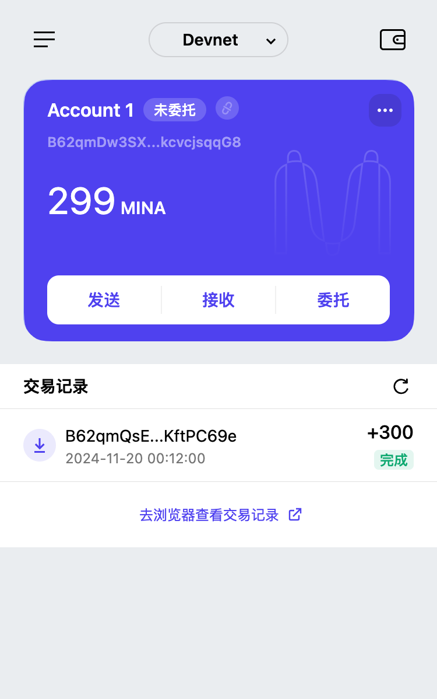

### task1：创建 auro wallet 账户，完成水龙头领水

1. 概述 Mina 所采用的证明系统(包括名称、特点)

- 名称：
零知识简洁非交互性证明 | zk-SNARK (Zero-Knowledge Succinct Non-Interactive Argument of Knowledge).

- 特点：
采用递归 zk-SNARK, 将区块链中所有历史交易压缩为单个简洁证明, Mina 链始终保持 22KB 大小!

2. 概述递归零知识证明在 Mina 共识过程中的应用

- 区块链大小的恒定性：
Mina 通过递归零知识证明（zk-SNARKs）技术，使得区块链大小始终保持在约 22KB，无论网络中有多少交易或用户这是因为 Mina 不需要存储所有的交易历史数据，而只需要存储一个代表当前状态的零知识证明。新的 node 加入不用下载整个链的所有 node 数据，使得终端节点更加轻量化。

- 验证过程的简化：
Mina 利用零知识证明的特性，将区块链的验证过程从验证所有的数据转变为验证一个证明，这样任何人都可以轻松地下载和验证整个区块链，而无需依赖于第三方服务提供商

- 递归引用自身：
Mina 使用的 zk-SNARKs，支持递归引用自身来创建证明的证明，从而能保持区块链的大小固定这种递归特性使得 Mina 能够在不增加证明大小的情况下，不断地在已有的证明上添加新的证明层

- 隐私性保护：
Mina 区块链的零知识证明仅证明状态有效，而不显示交互账户。从而可以不泄露任何不必要的信息而能证实自身的状态有效性，因此能保证隐私性。

3. 下载安装 [Auro wallet](https://www.aurowallet.com/download/)，创建账户，并完成[领水](https://faucet.minaprotocol.com/)

    钱包账户截图: 

    领水 `tx hash`: 5Juueu6xshYeBfH3jM88YnxFGXqS7yiwUPejWRm3fMdkhbJpGETx
