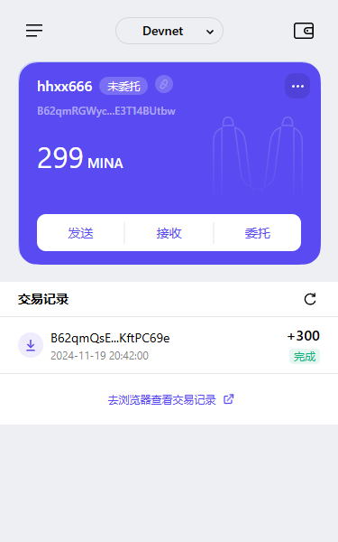

### 1. 概述Mina所采用的证明系统（包括名称、特点）

Mina Protocol 使用的是递归零知识证明（zero knowledge proof）- zk-SNARKs。其特点包括：
- **简洁性**：递归零知识证明允许将多个证明压缩成一个单一的、固定大小的证明。无论区块链的长度或交易数量如何增长，验证者只需验证一个相对较小的证明，大大降低了存储和验证成本。
- **隐私性**：零知识证明的核心特性是在不泄露具体交易细节的情况下，证明某个陈述是真实的。在 Mina 中，这意味着参与者可以验证交易的有效性，而无需知道交易的具体内容，从而保护了用户的隐私。
- **高效性**：通过递归证明技术，Mina 能够快速生成和验证证明，提高了区块链的共识效率，使得交易能够更快地被确认和记录在链上。

### 2. 概述递归零知识证明在 Mina 共识过程中的应用

递归零知识证明在 Mina 共识过程中的应用包括：
- **区块链大小的恒定性**：Mina 通过递归零知识证明（zk-SNARKs）技术，使得区块链大小始终保持在约 22KB，无论网络中有多少交易或用户。这是因为 Mina 不需要存储所有的交易历史数据，而只需要存储一个代表当前状态的零知识证明。新的节点加入时无需下载整个链的所有节点数据，使得终端节点更加轻量化。
- **验证过程的简化**：递归零知识证明使得 Mina 在共识过程中只需要验证最新的区块的合法性，而不需要验证所有区块的合法性，大大压缩了计算量。尽管区块链不断增长，但是证明的大小始终不变，避免了传统区块数据膨胀的问题。资源较少的设备也能轻松参与区块验证过程，提高了网络的去中心化程度。

### 3. 截图

`tx hash`: 5JuN6NhuoRr4PwyviAXtnJ9N6MC2uLdUK34C2SXCkTFxXri52Dr7

