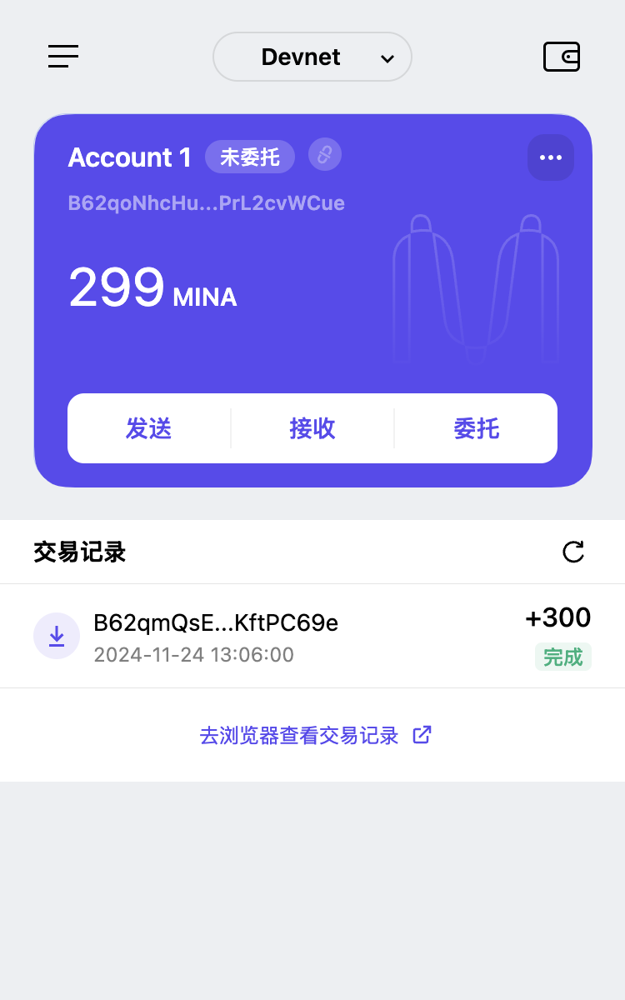

### task1：创建 auro wallet 账户，完成水龙头领水

#### 1. 概述Mina所采用的证明系统(包括名称、特点)

    Mina Protocol 采用递归零知识证明系统。

    特点：
    - 零知识性：验证者可以确认某项声明为真，而不需要知道具体的输入数据。
    - 简洁性：证明的大小非常小（几十字节），验证时间短，计算成本低。
    - 非交互性：无需多轮通信，生成一个证明后直接提供给验证者即可。

#### 2. 概述递归零知识证明在 Mina 共识过程中的应用

    1.区块链的状态验证

	Mina 每生成一个新区块，就会生成对应的 ZK-SNARKs 证明，用于证明该区块及其前所有区块的合法性。
	下一区块的 ZK-SNARKs 证明会递归地包含前一区块的证明，形成一个递归链条。
	最终，整个区块链的状态可以用一个小型证明表示，验证者只需检查最新证明即可验证全网状态的合法性。

    2. 减少数据存储需求

	传统区块链（如 Bitcoin 和 Ethereum）要求节点存储所有区块数据，数据体积随时间线性增长。
	Mina 利用递归零知识证明，只需要保存最新区块的证明和区块头，节点即可验证整个链的正确性，无需下载或存储所有历史数据。

    3. 提升区块链的去中心化和轻量化

	递归零知识证明使得 Mina 成为世界上最轻量的区块链（~22KB），即使资源受限的设备（如手机或 IoT 设备）也可以运行完整节点。
	这种轻量化特性降低了运行节点的门槛，促进了去中心化和网络安全性的提升。

    4. 优化共识过程

	在 Mina 的共识过程中，验证者通过递归证明快速验证新区块的合法性，而不需要重新计算或回溯历史交易。
	这种机制显著提高了共识达成效率，降低了计算和通信成本。

#### 3. 下载安装 [Auro wallet](https://www.aurowallet.com/download/)，创建账户，并完成[领水](https://faucet.minaprotocol.com/)

请提交回答，钱包账户截图和领水 `tx hash`。

账户：B62qoNhcHuQpw2DTbAvM7KGLZKimHtPYG9S9pWSw1GPa6PrL2cvWCue

领水截图：

