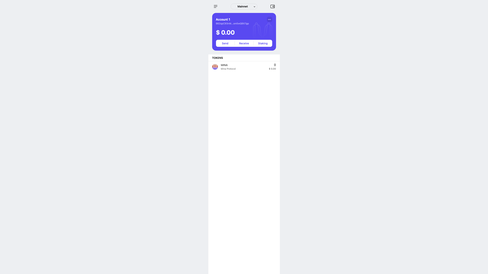

# task1：创建 auro wallet 账户，完成水龙头领水

1. 概述Mina所采用的证明系统(包括名称、特点)

ZKP 零知识证明 zk-SNARK
借助 zk-SNARK 的强大功能，Mina 保持了约 11 kB 的固定小尺寸。除了去中心化之外，zk-SNARKs 还使 Mina 比其他链更加隐私和高效。
Mina 通过称为递归 zk-SNARKs 的奇特密码学技术保持小而固定的大小，它代表零知识简洁的非交互式知识论证。
去中心化的改进
工作不对称
隐私
共识
2. 概述递归零知识证明在 Mina 共识过程中的应用

Mina 使用了一种称为 Pickles 的 zk-SNARK，它可以递归地引用自身，从而创建证明的证明并保持区块链的大小固定。Pickles 的另一个特性是，与其他 SNARK 不同，它不需要受信任的设置。受信任的设置被认为不太理想，因为未来的用户必须相信原始设置是在适当的控制下公平执行的。
在 zk-SNARKs 的帮助下，Mina 可以拥有一个保持较小且固定大小的区块链版本。每当添加一个新区块时，必须创建一个携带前一个区块的 zk-SNARK 的新 zk-SNARK 以证明它是有效的。只有在区块数据正确的情况下才能创建此 SNARK。因此，一个 SNARK 证明当前区块是有效的，并引用前一个区块的 SNARK 来证明它是有效的。这样，区块链的整个状态就可以通过验证当前的 SNARK 来确认，因为它必须是在一系列有效的 SNARK 之上生成的。
3. 下载安装 [Auro wallet](https://www.aurowallet.com/download/)，创建账户，并完成[领水](https://faucet.minaprotocol.com/)

- 钱包账户截图: 
- 领水 `tx hash`: 5JugQ7MyGDDVEDohca4ponD3NqwEehgLbfQrgwTLNxVBkZmLzm9M
<https://minascan.io/devnet/account/B62qpC93nMg6Xd9bmW2GRS216xLes3ACrtpo1ykm3A2Xhsm5wQBX7gp/txs>
