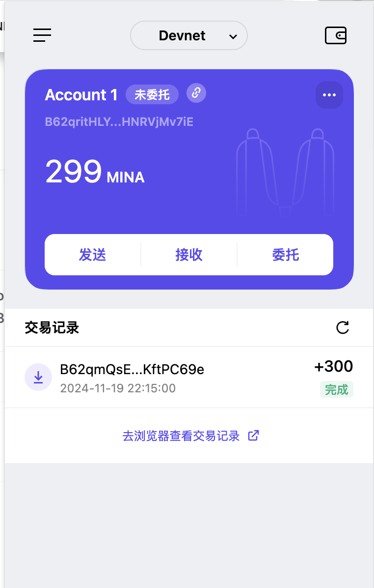

### task1：创建 auro wallet 账户，完成水龙头领水
   Mina Protocol 采用的是一种叫做 **零知识证明（ZK-SNARKs，Zero-Knowledge Succinct Non-Interactive Argument of Knowledge）** 的证明系统。具体来说，Mina 通过这种技术实现了轻量级区块链，即使在区块链的使用和扩展上，仍然能保持较小的存储需求。

### 特点：
1. **零知识证明（ZK-SNARKs）**：
   - **零知识性**：在不泄露信息的前提下，证明某个声明的真实性。例如，用户可以证明自己有足够的资金来进行交易，而无需透露具体的账户余额。
   - **简洁性**：证明的大小非常小，证明的验证也不需要很大的计算资源。
   - **无交互性**：验证者无需与证明者进行互动，可以直接验证证明的正确性。

2. **轻量级设计**：
   - Mina 的区块链大小始终固定在 22 KB 左右，即使随着区块链的使用和数据积累，网络状态的存储需求也不会显著增加。这使得任何人都可以通过普通设备（如手机）验证区块链。

3. **去中心化**：
   - 由于区块链大小恒定且轻量，更多的参与者可以参与到区块链的验证和共识中，从而增强去中心化的特性。

4. **高效的共识机制**：
   - Mina 使用 Ouroboros Samisika 协议（基于 Ouroboros 的分布式共识机制）来维护其网络的安全性和一致性。

总的来说，Mina 的零知识证明系统（ZK-SNARKs）是该协议的核心创新之一，它确保了区块链的可扩展性与轻便性，并允许广泛的去中心化参与者在不牺牲安全性或隐私的情况下，验证和维护网络。

2. 概述递归零知识证明在 Mina 共识过程中的应用

**递归零知识证明** 是 Mina Protocol 的核心技术之一，用于保持区块链的极简性和可扩展性。在 Mina 中，递归零知识证明通过将所有区块链的历史和状态压缩成一个小型的零知识证明（ZK-SNARK），实现了“轻量级”区块链。

### 递归零知识证明在 Mina 中的应用：
1. **区块链的简洁性**：
   - Mina 不存储整个区块链的历史，而是通过递归零知识证明来验证整个区块链的正确性。
   - 每个新区块的生成会创建一个新的零知识证明，它既证明当前区块的合法性，也继承了之前所有区块的历史证明。
   - 这种递归压缩使得整个区块链的大小始终保持在约 **22 KB**，无论链上发生了多少交易。

2. **共识过程中的验证**：
   - **Ouroboros Samisika 共识协议**：Mina 的共识机制确保新区块由一个生产者生成，同时使用递归零知识证明来证明新区块的有效性。
   - 节点只需要下载最新的递归证明，而无需保存整个区块链历史，从而降低了存储和计算成本。

3. **轻节点的参与**：
   - 普通用户（轻节点）只需要一个小的零知识证明即可验证整个区块链的状态。这种设计降低了设备要求，甚至手机或浏览器都可以安全参与验证过程。
   - 与传统区块链需要同步庞大的链数据相比，Mina 的递归零知识证明让用户几乎不需要额外的硬件资源。

4. **递归的运行原理**：
   - 每个区块包含一个零知识证明（证明这个区块的交易和状态是有效的）。
   - 递归技术将多个证明“压缩”成一个新的、更小的证明。
   - 最终，整个区块链的合法性都被浓缩到一个单一的证明中。

5. **可扩展性和去中心化的保障**：
   - 递归零知识证明的使用降低了验证成本，使得更多用户能够轻松参与到网络的验证和共识中，从而增强了 Mina 的去中心化。
   - 同时，固定的区块链大小使得 Mina 可以在全球范围内无缝扩展。

### 总结：
递归零知识证明是 Mina 实现“世界上最轻量级区块链”的核心技术。通过将所有区块链的历史和状态压缩为一个不断更新的零知识证明，Mina 保持了固定的链大小，同时保证了高效的验证和强大的隐私性。这种技术不仅提高了区块链的可用性，也为未来的去中心化应用（DApps）提供了一个轻便、高效的基础设施。

3. 下载安装 [Auro wallet](https://www.aurowallet.com/download/)，创建账户，并完成[领水](https://faucet.minaprotocol.com/)

    tx hash: 5JuxMVJNFGQ1Bxe3Kx7EGWWYLMX95gdBAwQNkBoGRXHyUg6GsZFj
             
    

