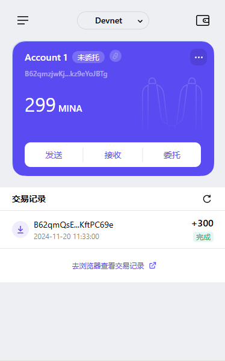

# task1

### 1. 概述Mina所采用的证明系统(包括名称、特点)

- Mina协议采用了一种被称为zk-SNARK（Zero-Knowledge Succinct Non-Interactive Argument of Knowledge的零知识证明系统。

- 高效性与简洁性：zk-SNARK是“简洁”的，意味着证明的大小是恒定的（独立于被证明计算的规模），并且验证时间也非常短。这种简洁性对于区块链应用非常关键，因为可以大幅降低存储和验证成本。

- 非交互性：zk-SNARK只需要一次性的证明和验证，不需要来回的交互通信，这种特性使得其在区块链网络中更高效。

- 零知识性：zk-SNARK能够证明某一声明的真实性，而无需泄露具体内容或任何其他额外信息。例如，可以证明一个交易是有效的，而不需要公开交易的具体细节。

- 支持高频更新：Mina通过这种证明系统实现了区块链状态的“固定大小”（~22KB），即使区块链不断增长，其区块大小和验证需求依然保持恒定。

- 安全性：zk-SNARK依赖于先进的密码学假设（如椭圆曲线对和加密安全假设），提供较高的抗攻击性。

### 2. 概述递归零知识证明在 Mina 共识过程中的应用

- 递归零知识证明的核心思想是将一个零知识证明嵌套到另一个零知识证明中，从而实现对多个步骤或状态的压缩。这种机制允许 Mina 的区块链保持固定大小，而不随时间增长。

- 区块链状态的压缩：Mina 使用 zk-SNARKs 生成每个新区块的零知识证明，该证明表明区块链从前一个状态正确地过渡到当前状态。通过递归 zk-SNARK，Mina 能够将所有历史区块的证明嵌套为一个单一的证明。这意味着，无需保存整个链的历史数据，用户只需验证递归证明即可确认整个链的正确性。

- 验证过程的高效性：在传统区块链中，验证节点需要下载并验证所有区块，从创世块开始重建链的状态。而 Mina 的递归零知识证明仅需要验证最新的递归证明，验证开销极低。这使得 Mina 的验证器可以直接在轻量设备（如手机或浏览器）上运行，降低硬件要求。

- 共识过程中的证明生成：在 Mina 的 Ouroboros Samasika 共识协议中，区块生产者需要生成一个 zk-SNARK 证明，以证明新区块的交易和状态转换是有效的。递归证明确保了前一个区块的验证和当前区块的状态转换可以被压缩到单一的证明中，减少数据冗余。

- 支持去中心化：Mina 的递归证明机制大幅降低了节点的存储需求，使得任何人都可以轻松运行节点。这有助于实现更广泛的去中心化，提高网络的安全性和抗审查能力。

### 3. 下载安装 [Auro wallet](https://www.aurowallet.com/download/)，创建账户，并完成[领水](https://faucet.minaprotocol.com/)

- tx hash: 5JupJoKiNZjQ7e45Q3kDqBkbrc6AuHuRC9rwDM7udzvybkQLVFAG

