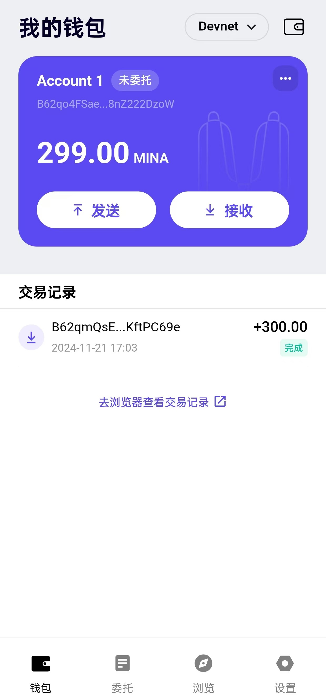

## 1. 概述Mina所采用的证明系统(包括名称、特点)

Mina 使用的是零知识证明系统，具体为 zk-SNARKs（Zero-Knowledge Succinct Non-Interactive Argument of Knowledge）。其特点包括：
- **零知识性（Zero-Knowledge）**：证明者可以在不透露具体信息的情况下，向验证者证明某件事为真。
- **简洁性（Succinctness）**：证明文件非常小，验证时间极快。
- **非交互性（Non-Interactive）**：证明过程无需多轮交互。
- **递归性（Recursion）**：支持递归证明，允许将多个证明压缩成一个单一的、固定大小的证明。

## 2. 概述递归零知识证明在 Mina 共识过程中的应用

递归零知识证明在 Mina 共识过程中具有以下应用：
- **区块链大小的恒定性**：通过递归零知识证明，Mina 的区块链大小始终保持在约 22KB，无需存储所有的交易历史数据。
- **高效验证**：验证者只需验证一个小型证明，大大降低了存储和验证成本。
- **隐私保护**：在不泄露具体交易细节的情况下，验证交易的有效性。
- **去中心化**：资源较少的设备也能轻松参与区块验证过程，提高了网络的去中心化程度。

## 截图

`tx hash`: 5JvBDYT2nnzeomjasZuoWi8S1F5Z1F2AZoQkKtKqBa16tYhbwbM4