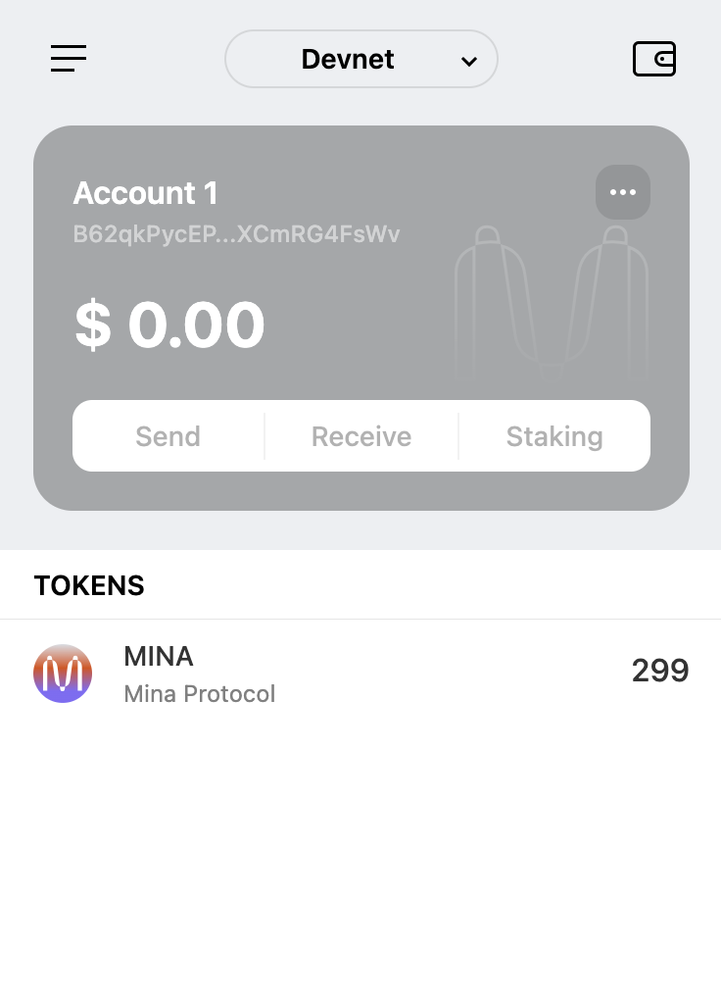

# Mina Boot Camp: task1

## 概述Mina所采用的证明系统(包括名称、特点)

### Kimchi

- A general-purpose **zero-knowledge proof system** for proving the correct execution of programs
- A collection of improvements, optimizations, and alterations made on top of **zkSNARK-PLONK**
- Prove and verify information in a private and decentralized way
- By using recursion, the computations stay small, scalable, and efficient, allowing the Mina blockchain to maintain a consistent size of 22KB, regardless of the number of transactions or blocks added to the chain.
- High Performance
- No Trusted Setup
- Unlimited Constraints

---

## 概述递归零知识证明在 Mina 共识过程中的应用

Recursion zkSNARK: With full recursion support using the Pickles recursion layer, Kimchi proofs and incorporate many proofs into a single one, for efficient verification.

- Block producing process(high-level view)
  1. validate a batch of Tx -> _generate TxBatchProof_
  2. construct new _Block_i_ based on _Tx Batch_ & _lastBlock’s hash_ -> _generate BlockProof_i_ (including verify TxBatchProof internally)
  3. generate _ChainProof_i_ based on _ChainProof_i-1_ & _BlockProof_i_
     - Each _ChainProof_i_ means : The Whole Chain History from GenesisBlock to _Block_i_ is Valid.

---

## 下载安装 Auro wallet，创建账户，并完成领水

- **Wallet**
  

- **Tx Hash:** 5JurcPfbg9EExCPbqm73FrRWJkvCZ2ZLGPQkPJYehcY8vgsiAXoC
