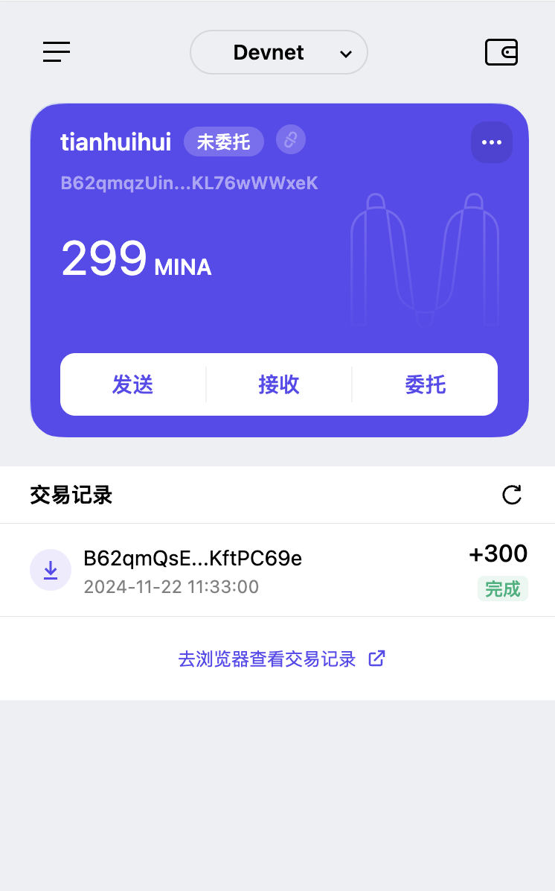

# 创建Auro wallet账户，完成水龙头领水

#### 1. 概述Mina所采用的证明系统(包括名称、特点)
答：
Mina Protocol 采用的证明系统叫 **Pickles**，基于 zk-SNARK 的递归零知识证明系统。Pickles 的核心特点包括：  

1. **递归零知识证明**：允许一个证明验证前一个证明，极大压缩区块链数据，使 Mina 的链大小始终保持在 ~22 KB。  
2. **无可信设置**：基于 Halo 技术，无需依赖复杂的可信初始化，提升了系统安全性和透明性。  
3. **高效性与简洁性**：证明生成和验证速度快，适合高频交易；生成的证明体积小，节省资源。  
4. **支持通用计算**：能够验证任意复杂计算，适配多样化智能合约需求。  

Pickles 的设计结合了 PLONK 和 Halo 技术，确保 Mina 实现了轻量级、高效、安全的区块链，成为世界上“最轻的区块链”。

#### 2. 概述递归零知识证明在 Mina 共识过程中的应用

答：
Mina 的共识机制使用的是 **Ouroboros Samisika**，一种基于权益证明（PoS）算法的共识协议。递归零知识证明被用来验证整个区块链的有效性，而不需要存储整个区块链的历史数据。递归证明允许将先前区块的证明嵌套到当前区块的证明中，这意味着每个新区块只需要包含当前区块的状态和一个证明，而不需要保存所有历史交易数据。

##### **应用流程：**
1. **验证和压缩历史**：每个新生成的区块通过递归零知识证明对前一个区块进行验证，从而确保区块链历史的有效性。每个区块生成一个紧凑的证明，递归地验证之前的区块，形成一个连续的、有效的链条。
2. **轻量化存储**：由于递归证明的特性，Mina 区块链的大小始终保持在约 22 KB，这使得任何节点都能快速验证当前状态，而不需要下载完整历史。
3. **验证速度与安全性**：递归证明的设计不仅提高了验证效率，还增强了网络的安全性，因为每个新区块的证明都能确保整个历史链条的正确性，无需信任外部数据源。

通过这种方式，Mina 在确保去中心化和安全性的同时，克服了传统区块链面临的扩展性问题，实现了极为轻量且高效的区块链系统。

#### 3. 下载安装 [Auro wallet](https://www.aurowallet.com/download/)，创建账户，并完成[领水](https://faucet.minaprotocol.com/)

答：

**tx hash**: 5JuTAQhvaKLQov2qFZ5cfhKNzAurKKYyHC7e6yBvgEVAJaPHcw1x

