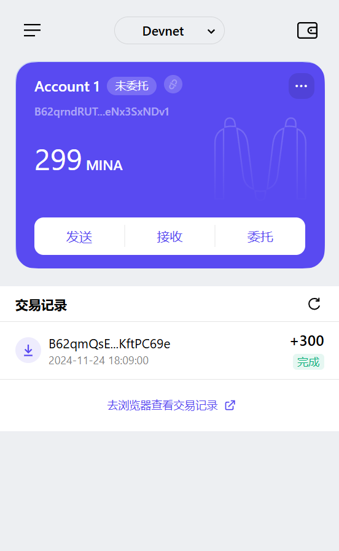

### task1：创建 auro wallet 账户，完成水龙头领水

1. 概述 Mina 所采用的证明系统(包括名称、特点)

Mina 采用的是 zk-SNARK (Zero-Knowledge Succinct Non-Interactive Argument of Knowledge) 证明系统，具体为 Pickles SNARK。其主要特点包括:

- 零知识性(Zero Knowledge): 证明者可以向验证者证明某个声明是正确的,而无需透露任何其他信息
- 简洁性(Succinct): 证明的大小很小且验证时间很短,与计算的复杂度无关
- 非交互性(Non-Interactive): 证明者只需要发送一个证明给验证者,无需多轮交互
- 可组合性(Composable): 可以将多个证明组合成一个证明,支持递归证明
- 通用性(Universal): 可以证明任意计算语句的正确性
- 后量子安全(Post-Quantum Security): 采用基于椭圆曲线的算法,可以抵抗量子计算攻击

2. 概述递归零知识证明在 Mina 共识过程中的应用

Mina 通过递归零知识证明在共识过程中实现了独特的轻量级区块链架构:

- 区块链压缩
  - 通过递归证明，将整个区块链的状态压缩为固定大小(约22KB)的 zk-SNARK 证明
  - 新区块生成时，会生成一个新的证明，包含了之前所有状态的有效性证明
  - 验证节点只需验证最新的 SNARK 证明，无需存储完整链历史

- 快速同步
  - 新节点加入网络时只需下载最新状态的 SNARK 证明(22KB)
  - 无需下载和验证完整的区块历史
  - 显著降低了节点参与网络的门槛

- 验证计算
  - 区块生产者(Block Producer)生成包含交易的新区块
  - 同时生成证明当前区块和之前所有状态都是有效的递归证明
  - SNARK 工作者(SNARK Worker)帮助生成证明以分担计算负载

这种基于递归证明的架构使 Mina 成为第一个恒定大小的区块链，无论运行多久，验证节点所需存储空间都维持在约22KB。

3. 下载安装 [Auro wallet](https://www.aurowallet.com/download/)，创建账户，并完成[领水](https://faucet.minaprotocol.com/)

    钱包账户截图: 

    领水 `tx hash`: https://minascan.io/devnet/tx/5Jttp723wi6gHwmE7DuQpqNbXTFebNMJfTNShgnhYqjovSXMod6b