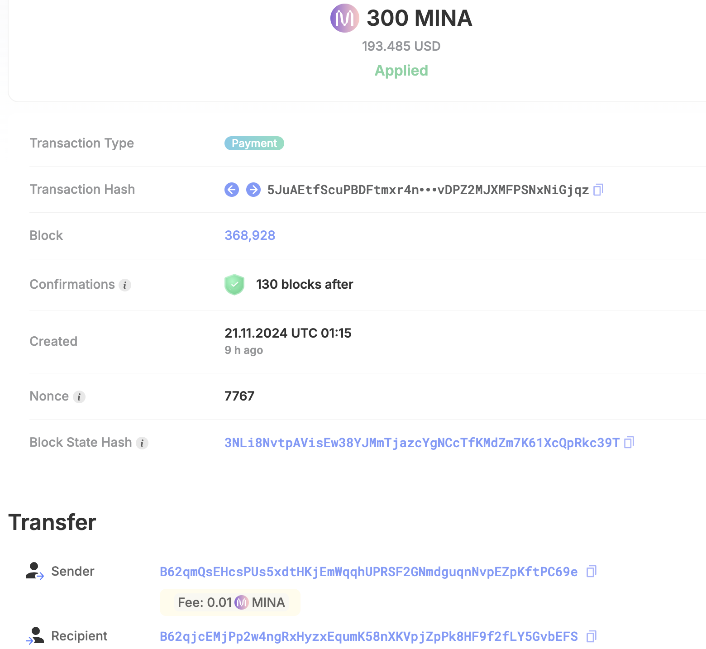

### task1：创建 auro wallet 账户，完成水龙头领水

1. 概述Mina所采用的证明系统(包括名称、特点)

名称：Kimchi，属于 zk-SNARK

特点: 
- simplified trusted setup: Mina 的 Kimchi 无需 Trusted Setup
- recursion zkSNARK: 支持递归证明
- general-purpose zkp: 通用的零知识证明协议
- small proof size: 生成的证明体积小

2. 概述递归零知识证明在 Mina 共识过程中的应用

- 通过递归零知识证明，每个新区块生成一个证明，包含了整个链状态的有效性证明，使Mina的大小固定在22KB。
- 高效同步：新加入的验证节点只需要验证最新的区块，同步快，减少传输带宽。
- 低资源需求：手机、网页可以轻松运行和验证区块链。
- 保证了安全性和隐私性。

3. 下载安装 [Auro wallet](https://www.aurowallet.com/download/)，创建账户，并完成[领水](https://faucet.minaprotocol.com/)

tx hash: 5JuAEtfScuPBDFtmxr4nwEGDEPyrJpWQvDPZ2MJXMFPSNxNiGjqz

