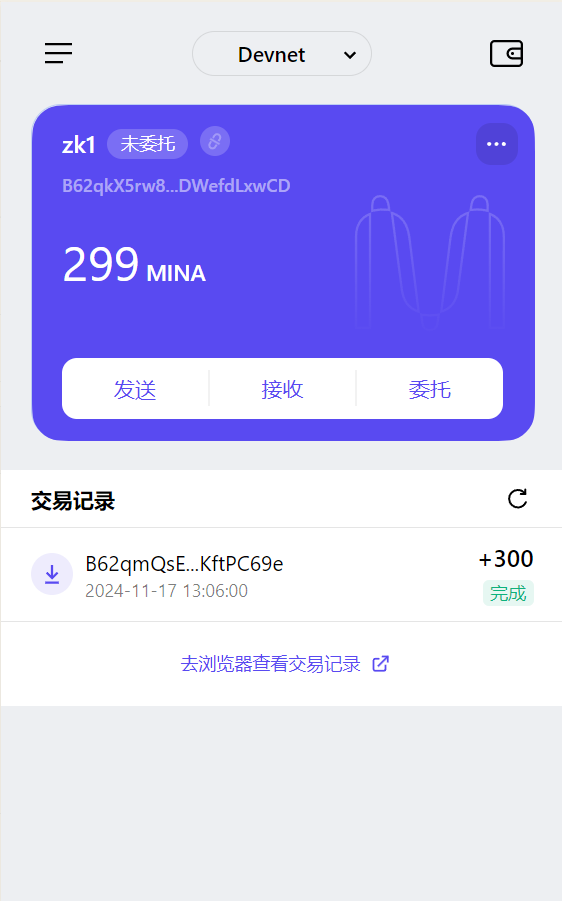

1. 概述Mina所采用的证明系统(包括名称、特点) 
   
    Mina 使用的是zero knowledge proof- zk-SNARKs，因为 Mina将 zkf 与线性递归和树形递归进行结合，从而不需要存储所有的交易历史数据，而只需要存储一个代表当前状态的零知识证明。使得区块链大小始终保持在约 22KB。
    这种设计有以下优势：
    1> 低资源需求
        可以在一个手机、一个网页里轻松运行和验证区块链
        无需担心数据膨胀带来的存储压力
    2> 高效同步
        快速启动
        减少传输带宽

2. 概述递归零知识证明在 Mina 共识过程中的应用     

    1> 区块链大小的恒定性：

       Mina 使用zk-SNARKs技术，使得区块链大小始终保持在约 22KB。因为 Mina 不需要存储所有的交易历史数据，而只需要存储一个代表当前状态的零知识证明。新节点加入不用下载整个链的所有 node 数据，使得终端节点更加轻量化。

    2> 验证过程的简化：

       Mina 利用零知识证明的特性，将区块链的验证过程从验证所有的数据转变为验证一个证明，这样任何人都可以轻松地下载和验证整个区块链，而无需依赖于第三方服务提供商

    3> 递归引用自身：

       Mina 使用的 zk-SNARKs，支持递归引用自身来创建证明的证明，从而能保持区块链的大小固定这种递归特性使得 Mina 能够在不增加证明大小的情况下，不断地在已有的证明上添加新的证明层    

    4> 隐私性保护：

       Mina 区块链的零知识证明仅证明状态有效，而不显示交互账户。从而可以不泄露任何不必要的信息而能证实自身的状态有效性，因此能保证隐私性。

3. 下载安装 Auro wallet，创建账户，并完成领水

tx hash: 5JuiUtkkDKFRCXNkeU6z8ECih5DuNEpwRvCMNgEUgutFL3hqkqxR
