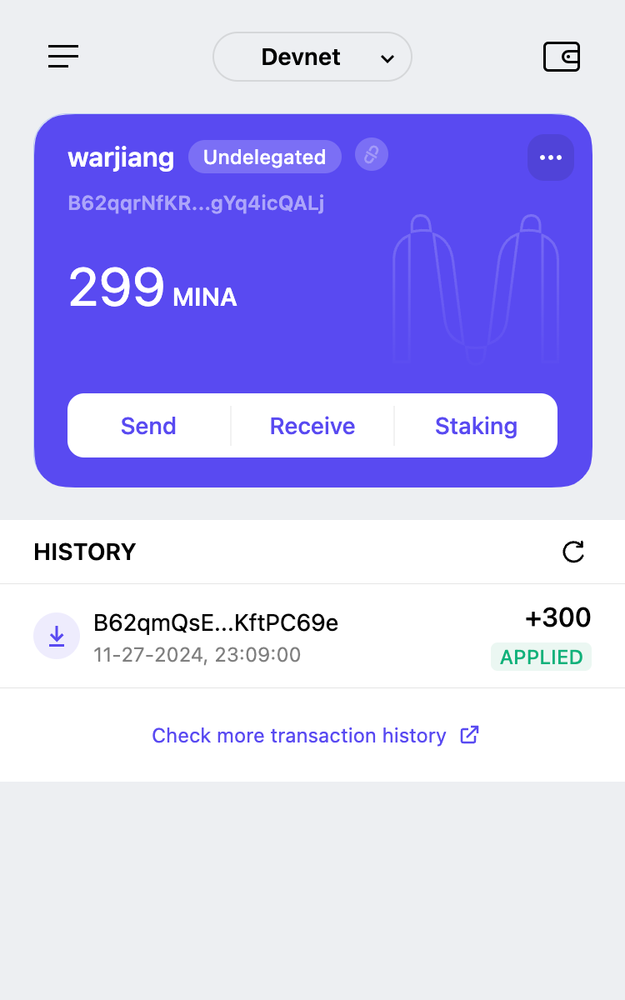

### task1：创建 auro wallet 账户，完成水龙头领水

1. 概述Mina所采用的证明系统(包括名称、特点)
Mina采用了Kimchi的零知识证明系统, 基于PLONK的定制证明系统。
具备以下特点:
- **递归证明能力**: Kimchi通过与Pickles递归系统的集成,支持无限递归证明构建
- **高效验证**: 验证时间恒定,与计算规模无关
- **轻量级**: 生成的证明大小固定,约22KB
- **可组合性**: 证明可以被组合和重用,支持模块化开发

2. 概述递归零知识证明在 Mina 共识过程中的应用
- 轻量级存储，链状态被压缩为固定大小，无需完整存储交易历史。
- 隐私保护，零知识特性隐藏交易细节，仅验证其合法性。
- 高效验证，新节点只需验证最新的递归证明即可加入网络。

3. 下载安装 [Auro wallet](https://www.aurowallet.com/download/)，创建账户，并完成[领水](https://faucet.minaprotocol.com/)

请提交回答，钱包账户截图和领水 `tx hash`。

tx hash:
5JuSNUBPu67Pg5QsVt9bFSsD2U42fx2W82ZgJvzqmfx3AgRnvoXx

