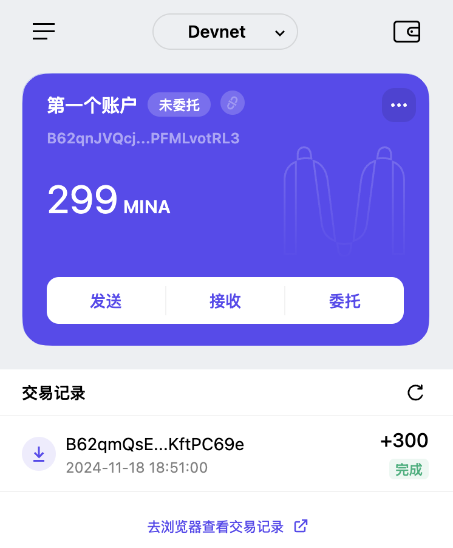

# Task1 

# 1. 概述Mina所采用的证明系统(包括名称、特点)
Mina 的证明系统有以下几个特点
* zk-SNARKs；
* 基于 plonk 算法改良，省去 Trusted Setup 过程；
* 递归证明，简化验证过程；

# 2. 概述递归零知识证明在 Mina 共识过程中的应用
压缩区块为一个递归证明，全链状态通过验证最后一个证明（也就是最新区块）即可验证从创世区块到当前区块的合法性。

# 3. 下载安装 Auro wallet，创建账户，并完成领水
faucet tx hash: 5Ju6fCnMiZfw56Bn7wMM6BZBnR8JgkQWKfAhxu5t9JPrYfkA2nJP 

