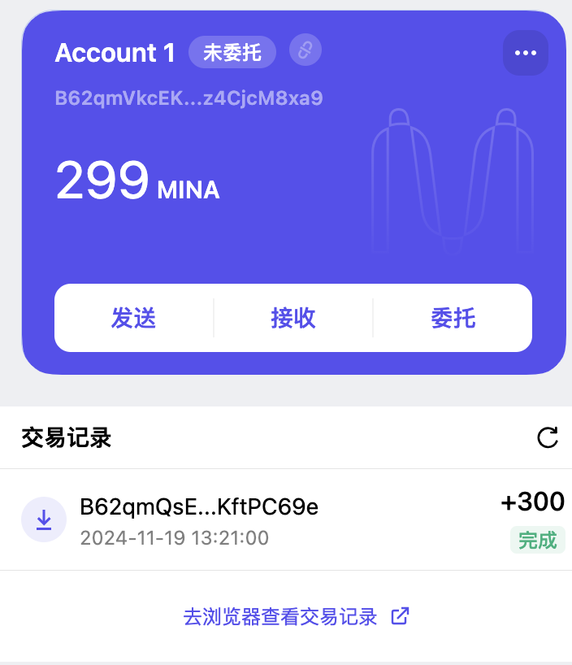

## 1. 概述 Mina 所采用的证明系统(包括名称、特点)

使用了一种名为 ZK-SNARKs 的零知识证明系统  
零知识：可以证明某件事情的真实性，而无需暴露具体内容。  
简洁性：证明的大小小且验证速度快，无需重复整个计算过程。  
非交互性：证明者和验证者之间只需要一次通信，不需要来回交互。  
知识论证：证明者能够证明其拥有某些特定信息，而不是仅仅知道它存在。

## 2. 概述递归零知识证明在 Mina 共识过程中的应用

极小化区块链大小：Mina 被称为“世界上最轻的区块链”，使用 ZK-SNARKs 将整个区块链压缩为恒定大小（~22KB）。无论网络历史多么庞大，节点只需验证最新的零知识证明，而无需存储完整的区块链历史。  
高效的同步性：任何设备都可以快速同步和验证网络，从而降低参与门槛。  
隐私性增强：利用零知识证明确保敏感数据的隐私，同时仍能满足验证需求。

## 3. 下载安装 Auro wallet，创建账户，并完成领水

tx hash : [5JuXFTNLxoRSZUjGNcSoDmScQKV4yECzVMiPdYK9j4DRaNz39uhB](https://minascan.io/devnet/tx/5JuXFTNLxoRSZUjGNcSoDmScQKV4yECzVMiPdYK9j4DRaNz39uhB)

