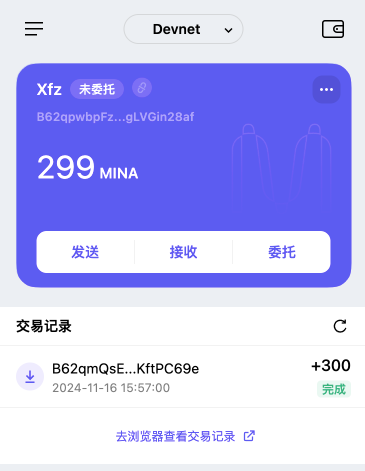

## 概述 Mina 所采用的证明系统(包括名称、特点)

Mina 采用了一种名为 ZK-SNARKs 的零知识证明系统，实现的方式是开发团队优化的 Recursive zk-SNARKs（递归零知识简洁非交互知识论证）， 主要有以下几个特点：零知识特性、简洁性、非交互性、递归性、超轻节点、计算高效性、区块链压缩 Mina 的核心创新在于通过 Recursive zk-SNARKs 实现了世界上最轻量级的区块链，其零知识证明特性不仅确保了隐私保护，还显著提高了验证效率，使得区块链可以适配更多应用场景。

## 概述递归零知识证明在 Mina 共识过程中的应用

链状态压缩、快速验证、提高区块链可扩展性、新区块生成和验证、轻节点和浏览器兼容性

最吸引入的就是递归可以将块数据压缩固定在 22kb，无需包含整个链上所有的块数据，只需验证最后一条数据，就可以验证整条链了

## 下载安装 [Auro wallet](https://www.aurowallet.com/download/)，创建账户，并完成[领水](https://faucet.minaprotocol.com/)

 
tx hash: 5JvQmq1y5ZW4FWEHyzEM2Btpqnq3Ab8h4x2Pt4hASV3YFy2uRuaj
