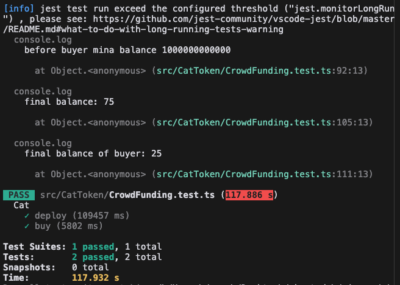
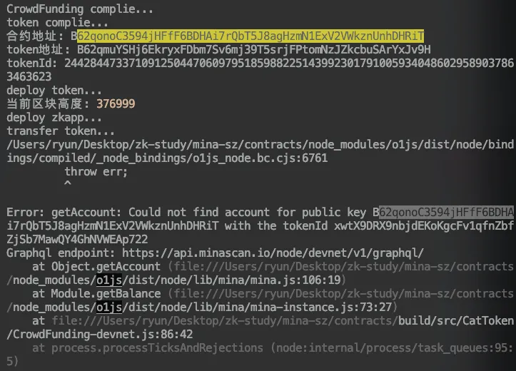

### task5：发行你自己的 token，然后设计一个众筹合约

1. 发行你自己的 `token`
2. 设计一个众筹合约，在指定时间窗口间允许任何人以固定的价格购买，有硬顶

请提交 `token` 地址，`Jest` 本地测试交互脚本，以及部署到 `DevNet` 的 `tx hash`。

### local test

### devnet

- token address: B62qmuYSHj6EkryxFDbm7Sv6mj39T5srjFPtomNzJZkcbuSArYxJv9H
- txn transfer:
