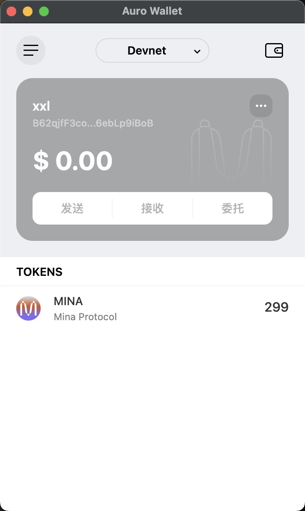

## 概述Mina所采用的证明系统(包括名称、特点)
Mina 采用的证明系统是零知识证明技术，特点是更好的隐私保护、更快的验证效率、更可靠的验证过程、更小的存储空间

## 概述递归零知识证明在 Mina 共识过程中的应用
在 Mina 中当获得一个证明为真的时候，这个证明会被代入下一个证明，如果下一个证明为真，那么之前的证明的均为真，这样可以无限递归下去

## 截图

tx hash: 5JtwczbZAadMmL6SgXrLociMDpBvFq6GJz3RVnr9zVU4F6EdjG9S
