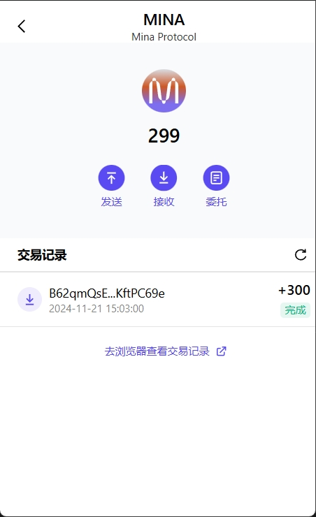

### task1：创建 auro wallet 账户，完成水龙头领水

1. 概述Mina所采用的证明系统(包括名称、特点)
2. 概述递归零知识证明在 Mina 共识过程中的应用
3. 下载安装 [Auro wallet](https://www.aurowallet.com/download/)，创建账户，并完成[领水](https://faucet.minaprotocol.com/)

请提交回答，钱包账户截图和领水 `tx hash`。

### 1.概述Mina所采用的证明系统(包括名称、特点)

Mina 采用了一种称为"zk-SNARKs"(Zero-Knowledge Succinct Non-interactive Argument of Knowledge)的证明系统，该证明系统具有以下特点：

- 零知识证明隐私安全：zk-SNARKs允许一方向另一方证明某个陈述的真实性，而无需透露多余的信息。
- 简短性：Mina区块非常小仅为22KB，允许网络参与者无需下载整个区块链的情况下进行验证。
- 快速验证：证明非常简洁，不会占用大量的存储空间，也降低了节点的资源消耗。

### 2.概述递归零知识证明在 Mina 共识过程中的应用

- 快速同步：新节点加入网络时，只需获取最新的状态证明和少量的区块头信息，就可以同步到最新的区块链状态。
- 安全性保障：通过零知识证明，节点可以确信整个区块链的历史交易都是有效的，而无需信任其他节点或第三方。
- 高效验证：共识过程中的验证步骤被最小化，节点无需执行大量的计算来验证历史交易。

### 3.下载安装 Auro wallet 创建账户，并完成领水

ts hash: 5Juee5tdsJKDjjwtzwiVePuKExHTWLTk5ziR29A5BZYssNjuT42e
