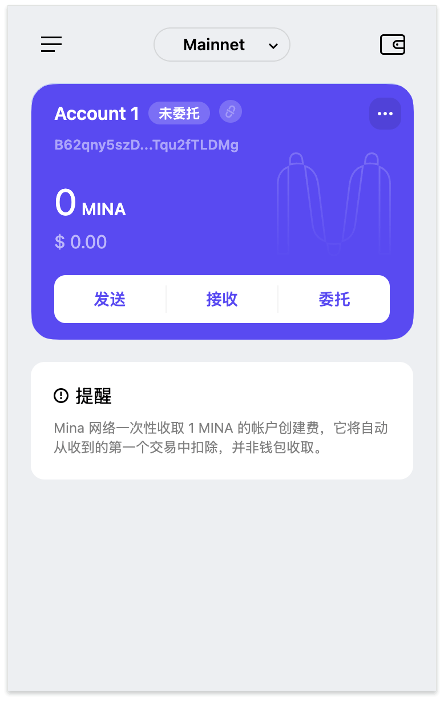

### task1：创建 auro wallet 账户，完成水龙头领水

1. 概述Mina所采用的证明系统(包括名称、特点)
Mina采用了一种名为 ZK-SNARKs 的零知识证明系统，实现的方式是开发团队优化的 Recursive zk-SNARKs（递归零知识简洁非交互知识论证），
主要有以下几个特点：零知识特性、简洁性、非交互性、递归性、超轻节点、计算高效性、区块链压缩
Mina 的核心创新在于通过 Recursive zk-SNARKs 实现了世界上最轻量级的区块链，其零知识证明特性不仅确保了隐私保护，还显著提高了验证效率，使得区块链可以适配更多应用场景。

2. 概述递归零知识证明在 Mina 共识过程中的应用 
主要的应用有以下几个方面：链状态压缩、快速验证、提高区块链可扩展性、新区块生成和验证、轻节点和浏览器兼容性

3. 下载安装 [Auro wallet](https://www.aurowallet.com/download/)，创建账户，并完成[领水](https://faucet.minaprotocol.com/)

 

tx hash：5Juuv5dZXsp6DEo3kk7SA5fteNCZEsY3CPwW2P6tiSBANka1drTR

请提交回答，钱包账户截图和领水 `tx hash`。

