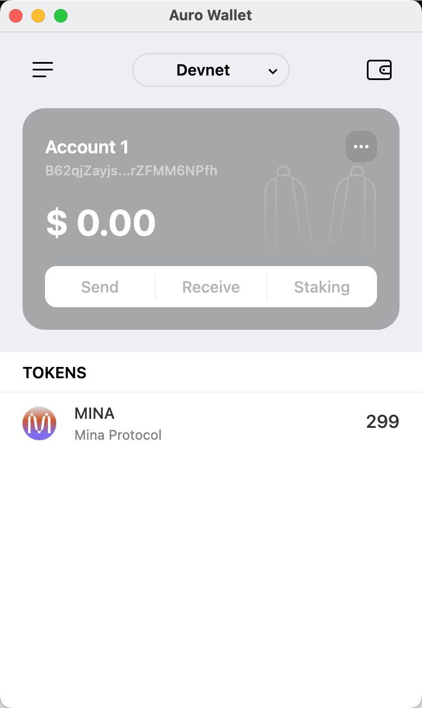

## Task 1

> 参考资料：https://z.cash/learn/what-are-zk-snarks/

### 概述Mina所采用的证明系统

Mina所采用的是 zk-SNARK 证明系统,它具有以下特点：
- 零知识性（Zero-Knowledge）：可以在不透露任何信息的情况下，证明持有者。
- 非交互式（Non-Interactive）：zk-SNARK 证明仅需信息体积非常小的生成和验证，无需证明者与验证者多次通信。
- 简洁性（Succinct）：可以在几 ms 内完成验证，且生成的证明体积较小。

## 概述递归零知识证明在 Mina 共识过程中的应用

递归零知识证明在 Mina 共识过程中的应用，主要体现在其隐私保护和高效性上。Mina 使用的递归零知识证明，可以使区块链的大小保持在极小的水平，确保可以轻松验证整个区块链的有效性，不需要下载整个区块链，就能验证交易和状态。且不需要透露具体的交易细节，保证了信息私密。递归零知识证明在 Mina 共识过程中的应用，使得区块链更加轻量级和隐私友好。

## Trading hash & Wallet

`5Jtc8V46SEpvRkTH1k6k725VBDAVXA4DRMVCJUFj9ZFHL8sTsJFR`

