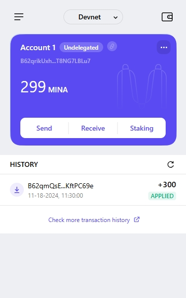

### task1：创建 auro wallet 账户，完成水龙头领水

1. 概述Mina所采用的证明系统(包括名称、特点)

零知识简洁非交互式知识论证（zk-SNARK）
特点：
1.让一个人向另一个人证明是真实的，而无需透露任何其他信息。
2.区块大小始终保持在22 KB左右，无论多少交易。
3.低配置设备也可以作为节点验证数据。

2. 概述递归零知识证明在 Mina 共识过程中的应用

压缩区块，向上递归验证交易的正确性，从而减少提供证明的次数，最后只需要一个当前状态的证明。

3. 下载安装 [Auro wallet](https://www.aurowallet.com/download/)，创建账户，并完成[领水](https://faucet.minaprotocol.com/)

请提交回答，钱包账户截图和领水 `tx hash`。

tx: 5Jtt4xDeHKHSteiTsgJAne2utFk7v5gE9fFwLYwTpvG69qRSUyGP

截图: 
