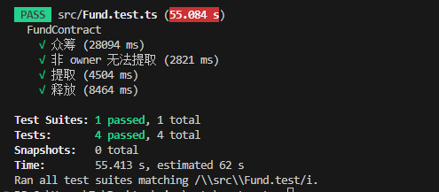

### 测试：

npx jest /src/Fund.test

### 部署：

package 新增配置

"very-simple-zkapp-devnet": "npm run build && node --experimental-vm-modules build/src/deploy.js"

部署

npm run very-simple-zkapp-devnet

### 结果：
测试：

tx：

B62qib5CefqQnd4B7HKgz2Gmbr15p25kusmxDHLEX4nkwDyvyg6PL49

