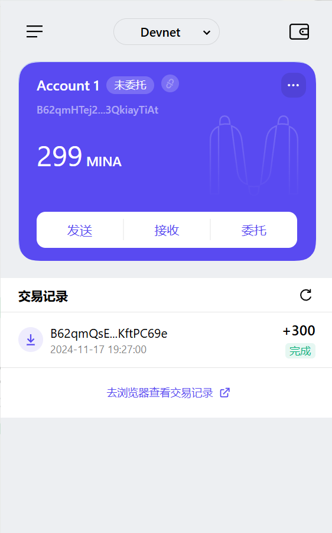

### task1：创建 auro wallet 账户，完成水龙头领水

1. 概述Mina所采用的证明系统(包括名称、特点)

    名称: Kimchi

    特点: 
   - simplified trusted setup
   - recursion zkSNARK
   - small proof size

2. 概述递归零知识证明在 Mina 共识过程中的应用

    Block producing process(high-level view):
    1. validate a batch of Tx -> generate TxBatchProof
    2. construct new Block_i based on Tx Batch & lastBlock's hash -> generate BlockProof i (including verify TxBatchProof internally)
    3. generate ChainProof_i based on ChainProf_i-1 & BlockProof_i
   
    Each ChainProof_i means: The Whole Chain History from GenesisBlock to Block_i is Valid.

3. 下载安装 [Auro wallet](https://www.aurowallet.com/download/)，创建账户，并完成[领水](https://faucet.minaprotocol.com/)

    tx hash: 5JuXCLKGXcuUgEwh9ua6mSxBWJA4BAJos2MQQRozDQffSfaUjwtP

    

